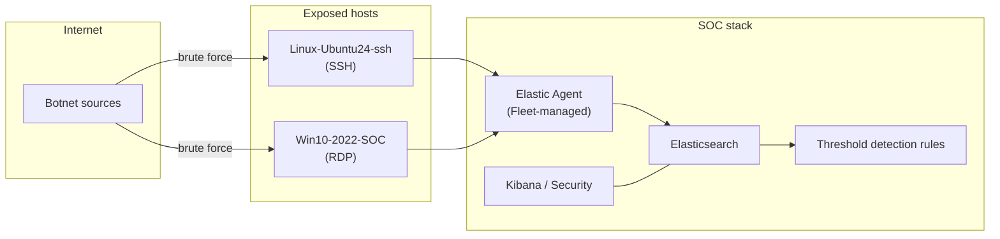

# Detection Engineering Homelab

Documentation of a self-hosted **Elastic Stack SOC homelab** and the detection
work I've done in it — authoring SIEM detection rules, analyzing real attack
telemetry, and triaging alerts end to end.

This is not a tutorial collection. The lab hosts were genuinely exposed to the
public internet and genuinely attacked; every number in these writeups comes from
real captured data, not simulation.

> **Scope & honesty.** The lab was built following the MyDFIR SOC challenge as a
> learning scaffold. The detection rules, log analysis, and triage conclusions
> are my own work against my own captured data. Each project states its own
> limitations.

## Lab architecture



Linux and Windows targets ship telemetry to a self-hosted Elastic Stack via
Fleet-managed Elastic Agent; threshold rules run against the indexed events and
raise alerts in Kibana Security.

## Projects

| Project | What it shows | Status |
|---|---|---|
| [**ssh-bruteforce-detection**](ssh-bruteforce-detection/) | Threshold rule for SSH brute-force against `root`; analysis of 47,212 failed attempts from 82 IPs; triage of the one successful login (benign admin). | ✅ Complete |
| [**rdp-bruteforce-detection**](rdp-bruteforce-detection/) | Threshold rule for RDP brute-force against `Administrator`; analysis of 4,558 failed attempts from 176 IPs; a real case-sensitivity gap found in the rule. | 🚧 Draft (data real, prose pending) |

Each project folder is self-contained:

```
detection/   exported Elastic rule (.ndjson) + plain-English breakdown
evidence/    real captured logs/exports, an analysis summary, and IOC list
scripts/     a small parser that regenerates the summary from the raw data
blog/        longer-form narrative draft
```

## Skills demonstrated

Elastic Stack · Elastic Security / SIEM · detection engineering · threshold rules ·
KQL · Elastic Agent / Fleet · log analysis · alert triage (true/false positive) ·
IOC extraction · Linux & Windows host telemetry.

## A note on redaction

Attacking source IPs are retained as indicators of compromise. The administrator's
own source IP is redacted, and the SOC server's management URL is redacted to
`<SOC-IP>` in the exported rules. Nothing here exposes live management infrastructure.
