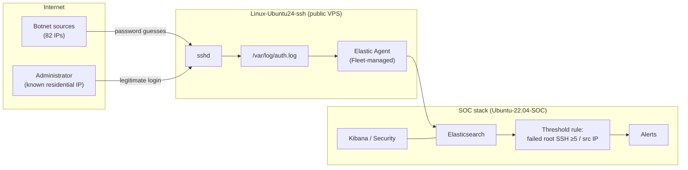

# SSH Brute-Force Detection & Triage — Elastic SIEM

Detecting, alerting on, and triaging a real SSH brute-force campaign against an
internet-facing Linux host, using a self-hosted Elastic Stack SOC lab.

This is not a tutorial walkthrough. The host was genuinely exposed to the public
internet and genuinely attacked — **47,212 failed login attempts from 82 distinct
source IPs over ~48 hours.** This repo documents the detection I built for it and,
more importantly, the **triage decision** on the one login that *succeeded*.

> **Scope & honesty.** The lab was built following the MyDFIR SOC challenge as a
> learning scaffold. The detection rule, the log analysis, and the triage
> conclusion in this repo are my own work against my own captured data. No part
> of the "incident" is simulated or fabricated — the attack traffic is real
> internet background radiation against a host I stood up. See
> [Honest limitations](#honest-limitations).

---

## TL;DR

- Internet-facing Ubuntu host ingesting `auth.log` into Elastic via Elastic Agent (Fleet-managed).
- Authored a **Threshold detection rule** that fires on ≥5 failed `root` SSH logins per source IP.
- Attack: **47,212** failed attempts, **82** unique IPs, top single source ~29,900 attempts, `root` targeted 42,545 times.
- **One** `Accepted password` event appeared. Triaged it → **benign administrator login**, not a compromise. **No unauthorized access occurred.**
- Documented the detection's real limitation (single-account scope) and host-hardening remediation.

---

## Architecture



Data flow: `sshd` writes auth events to `auth.log`; the Fleet-managed Elastic
Agent ships them to Elasticsearch; the detection rule runs every minute against
the indexed events; matches raise alerts in Kibana Security.

---

## The detection rule

Exported rule: [`detection/ssh_bruteforce_rule.ndjson`](detection/ssh_bruteforce_rule.ndjson) ·
Plain-English breakdown: [`detection/rule-explained.md`](detection/rule-explained.md)

| Field | Value |
|---|---|
| Name | SSH Bruteforce Attempt |
| Type | Threshold |
| Query (KQL) | `system.auth.ssh.event : * and agent.name : "Linux-Ubuntu24-ssh" and system.auth.ssh.event : "Failed" and user.name : "root"` |
| Threshold | group by `user.name`, `source.ip` — fire at **≥ 5** |
| Runs every | 1 min (6-min look-back) |
| Risk score / severity | 51 / Medium |

**Why Threshold, grouped by source IP:** a single failed password is noise; what
distinguishes a brute-force is *volume from one source*. Grouping by
`user.name, source.ip` and firing at 5 means one alert per attacking IP instead
of 47,000 alerts, which is the difference between a usable signal and alert
fatigue. The top source alone (87.106.13.39, ~29,900 attempts) clears the
threshold ~6,000× over.

---

## What the data showed

Full numbers: [`evidence/analysis_summary.md`](evidence/analysis_summary.md) ·
Raw evidence: [`evidence/auth_failed.txt`](evidence/auth_failed.txt) ·
IOC list: [`evidence/iocs.csv`](evidence/iocs.csv)

- **47,212** failed `Failed password` events, **Jun 28 00:00 → Jun 30 00:00** (~48h).
- **82** unique source IPs — this is a distributed, multi-host campaign, not one script.
- Username spray off a standard credential list: `root` (42,545), then `admin`, `user`, `ubuntu`, `debian`, `test`, `deploy`, `oracle`…
- Top attackers: `87.106.13.39` (29,867), `118.117.167.156` (8,982), `117.50.89.245` (995).

---

## Triage: the one login that succeeded

A single `Accepted password for root` event appears in the window:

```
Jun 30 00:00:05 Linux-Ubuntu24-ssh sshd[518620]: Accepted password for root from <REDACTED-ADMIN-IP> port 51630 ssh2
```

Pulled here (source IP redacted): [`evidence/auth_accepted_redacted.txt`](evidence/auth_accepted_redacted.txt)

**The question that matters: was this the brute-force succeeding?** Worked it the
way a SOC analyst would — correlate the successful source IP against the set of
attacking IPs:

1. The successful login came from a single IP.
2. That IP **does not appear once** in the 47,212 failed attempts. A cracked
   credential looks like the *same* IP failing repeatedly and then succeeding —
   this IP never failed at all.
3. The IP resolves to a residential ISP consistent with the host's
   administrator, not to any of the attacking infrastructure.

**Disposition: true positive login, benign.** Administrator authenticating
normally, unrelated to the brute-force. **No evidence of unauthorized access; no
compromise.**

This is the core analyst skill the repo demonstrates: a successful login during
an attack is *not* automatically a breach. The correlation between success source
and attack source is what separates a real incident from a false alarm.

---

## Honest limitations

A detection writeup that doesn't state its own gaps isn't finished.

- **Single-account scope.** The rule only matches `user.name : "root"`. The attack
  also sprayed `admin`, `user`, `ubuntu`, and others — **this rule does not catch
  those.** It was scoped to the highest-value target (root) deliberately, but a
  production rule would either broaden the account set or alert on failed-attempt
  volume per source IP regardless of username.
- **Threshold tuning is lab-grade.** `≥5` is fine for a quiet lab host; a busy
  production box with legitimate failed logins would need tuning to avoid noise.
- **No automated response.** Detection only — no fail2ban/SOAR action wired up.
  Manual hardening is documented below instead.

---

## Remediation (what I'd do / did to the host)

Detection is half the job; the host was genuinely exposed. Hardening steps:

- Disable password authentication, key-only (`PasswordAuthentication no`).
- Disable direct root SSH login (`PermitRootLogin no`).
- Deploy `fail2ban` to auto-ban sources crossing a failure threshold.
- Restrict SSH exposure (non-default port reduces noise; firewall/allowlist where feasible).

The benign admin login held only because the password wasn't guessed — that's
luck, not a control. Key-only auth removes the entire attack surface this repo is
about.

---

## Repo contents

```
detection/
  ssh_bruteforce_rule.ndjson   # the real exported Elastic rule
  rule-explained.md            # plain-English breakdown of the logic
evidence/
  auth_failed.txt              # raw failed-login events (real auth.log)
  auth_accepted_redacted.txt   # the successful login (admin IP redacted)
  analysis_summary.md          # headline stats, top IPs, top usernames
  iocs.csv                     # attacking source IPs as IOCs
scripts/
  analyze_auth_log.py          # regenerates the summary from raw logs
```

## Reproduce the analysis

```bash
python3 scripts/analyze_auth_log.py evidence/auth_failed.txt
```

---

*Lab: self-hosted Elastic Stack on Vultr (SOC server, Fleet server, Linux SSH
target). Telemetry via Fleet-managed Elastic Agent. The administrator source IP
is redacted throughout; attacking IPs are retained as indicators of compromise.*
